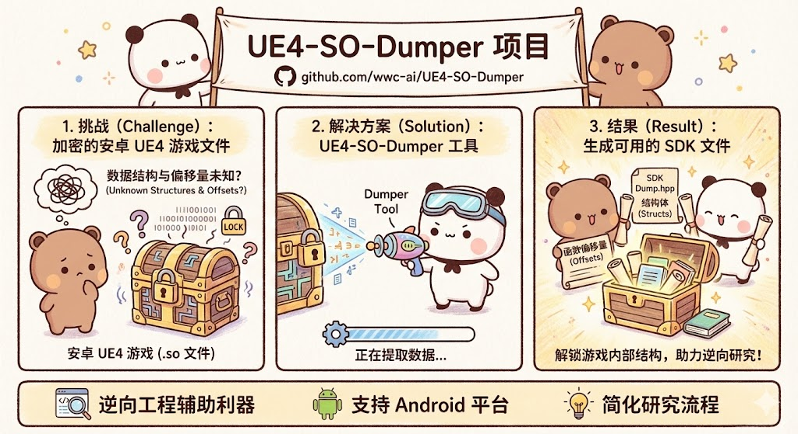

# 🎮 UE4 SO Dumper

<div align="center">


**一个用于从Android进程内存中Dump UE4 SO文件的专业工具**

[English](README_EN.md) | 简体中文

</div>

---

## 📖 简介

UE4 SO Dumper 是一个高效、可靠的Android原生工具，专门用于从运行中的进程内存提取Unreal Engine 4 (UE4) 的SO库文件。该工具确保Dump出的SO文件与APK中的原始文件**完全一致**，使其能够在IDA Pro等逆向工程工具中无缝分析，无需担心文件损坏或结构不完整的问题。

<div align="center">



*项目介绍：从挑战到解决方案，再到最终结果*

</div>

### ✨ 核心特性

- 🎯 **精确Dump** - 确保Dump的SO文件与原始文件100%一致
- 🔧 **自动修复ELF** - 自动修复ELF文件头，确保IDA Pro完美兼容
- 📊 **实时进度** - 带进度条的可视化Dump过程
- 🎨 **彩色输出** - 友好的彩色终端界面
- 🏷️ **自动命名** - 文件名包含基址和时间戳，便于管理
- 🔧 **灵活配置** - 支持Dump任意SO文件，不限于UE4
- 💪 **多架构支持** - 支持 ARMv7, ARM64, x86, x86_64
- 🚀 **高性能** - 优化的内存读取算法
- 📝 **详细日志** - 完整的操作日志记录

## 🎯 适用场景

- 🎮 **游戏安全分析** - 分析UE4游戏的代码逻辑
- 🔍 **逆向工程** - 为IDA Pro提供完整的SO文件
- 🛡️ **安全研究** - 研究游戏保护机制
- 📚 **学习研究** - 学习UE4引擎内部实现
- 🐛 **漏洞挖掘** - 寻找潜在的安全漏洞

## 📋 系统要求

### 开发环境
- **操作系统**: Windows / Linux / macOS
- **NDK版本**: Android NDK r21+ 
- **编译工具**: ndk-build (自带于NDK)

### 运行环境
- **Android版本**: Android 5.0 (API 21) 及以上
- **设备权限**: Root权限（必须）
- **ADB工具**: 用于文件传输和命令执行

## 🚀 快速开始

### 1️⃣ 克隆项目

```bash
git clone https://github.com/wwc-ai/UE4-SO-Dumper.git
cd UE4-SO-Dumper
```

### 2️⃣ 配置NDK环境

设置NDK环境变量（选择其一）：

```bash
# Linux/macOS
export NDK_ROOT=/path/to/android-ndk
# 或
export ANDROID_NDK_HOME=/path/to/android-ndk

# Windows (PowerShell)
$env:NDK_ROOT="C:\path\to\android-ndk"
```

### 3️⃣ 编译项目

```bash
chmod +x build.sh
./build.sh
```

编译成功后，在 `libs/` 目录下会生成对应架构的可执行文件：

```
libs/
├── armeabi-v7a/DumpUE4_SO  (32位ARM)
├── arm64-v8a/DumpUE4_SO    (64位ARM)
├── x86/DumpUE4_SO          (32位x86)
└── x86_64/DumpUE4_SO       (64位x86)
```

### 4️⃣ 推送到设备

```bash
# 推送可执行文件（根据设备架构选择）
adb push libs/arm64-v8a/DumpUE4_SO /data/local/tmp/

# 设置执行权限
adb shell chmod +x /data/local/tmp/DumpUE4_SO
```

### 5️⃣ 查找目标进程

```bash
# 方法1: 通过包名查找
adb shell "ps -A | grep com.your.package"

# 方法2: 查看所有进程
adb shell ps -A

# 输出示例：
# USER  PID   PPID  VSZ    RSS   WCHAN  PC         NAME
# u0_a123 12345 1234  2345678 234567 0  0000000000 com.tencent.tmgp.pubgmhd
```

记下 PID（进程ID），例如上面的 `12345`

### 6️⃣ 执行Dump

```bash
# 进入设备Shell
adb shell

# 切换到root权限
su

# 执行Dump（替换12345为实际PID）
cd /data/local/tmp
./DumpUE4_SO 12345

# Dump其他SO文件
./DumpUE4_SO 12345 libil2cpp.so
```

### 7️⃣ 获取Dump文件

```bash
# 退出设备Shell (Ctrl+D 或 exit)
exit
exit

# 拉取Dump文件到本地
adb pull /data/local/tmp/dump_output/ ./dumped_files/
```

## 📱 使用示例

### 自动化脚本

项目提供了自动化示例脚本 `example.sh`：

```bash
chmod +x example.sh
./example.sh
```

该脚本会自动：
1. ✅ 检查设备连接
2. ✅ 推送可执行文件
3. ✅ 查找目标进程
4. ✅ 执行Dump操作
5. ✅ 拉取文件到本地

### 命令行参数

```
用法: ./DumpUE4_SO <PID> [SO名称]

参数:
  PID      - 目标进程ID (必需)
  SO名称   - 要Dump的SO文件名 (可选，默认: libUE4.so)

示例:
  ./DumpUE4_SO 12345                # Dump libUE4.so
  ./DumpUE4_SO 12345 libUE4.so      # 同上
  ./DumpUE4_SO 12345 libil2cpp.so   # Dump libil2cpp.so
```

## 📊 运行效果

```
╔══════════════════════════════════════════════════════════╗
║              UE4 SO Dumper v1.1.0                        ║
║              Author: wwc-ai                              ║
║       https://github.com/wwc-ai/UE4-SO-Dumper      ║
╚══════════════════════════════════════════════════════════╝

[目标] PID: 12345, SO: libUE4.so
[信息] 正在读取进程 12345 的内存映射...
[发现] 0x7f8a000000-0x7f8a100000 r-xp offset:0x0 /data/app/.../libUE4.so
[发现] 0x7f8a100000-0x7f8a200000 r--p offset:0x100000 /data/app/.../libUE4.so
[发现] 0x7f8a200000-0x7f8a300000 rw-p offset:0x200000 /data/app/.../libUE4.so
[成功] 共找到 3 个内存区域
[基址] 0x7f8a000000
[输出] 文件路径: ./dump_output/libUE4_dump_0x7f8a000000_20260122_143025.so
[开始] 正在Dump内存数据...
[进度] [████████████████████████████████████████████████] 100% (52428800/52428800 bytes)

[修复] 正在修复ELF文件头...
[信息] 检测到64位ELF文件
[信息] 原始 e_shoff: 0x3200000, e_shnum: 26, e_shstrndx: 25
[成功] ELF文件头修复完成 (已清除Section Header信息)
[完成] Dump成功！
[文件] ./dump_output/libUE4_dump_0x7f8a000000_20260122_143025.so
[大小] 52428800 bytes (50.00 MB)
[总结] Dump完成，耗时: 5 秒

╔══════════════════════════════════════════════════════════╗
║  Dump完成！现在可以使用IDA Pro分析SO文件了！              ║
╚══════════════════════════════════════════════════════════╝
```

## 🛠️ 技术原理

### Dump流程

1. **读取内存映射** - 从 `/proc/[pid]/maps` 读取目标SO的内存布局
2. **定位基址** - 查找第一个可执行区域作为基址
3. **打开内存文件** - 访问 `/proc/[pid]/mem` 读取内存数据
4. **逐区域Dump** - 按照原始offset写入文件
5. **修复ELF文件头** - 自动清除无效的Section Header Table信息
6. **完整性保证** - 确保所有区域都被正确Dump

### 关键技术点

- **内存映射分析** - 精确解析maps文件获取内存布局
- **偏移量保持** - 保持原始SO的section offset不变
- **权限处理** - 正确处理不同权限的内存区域
- **错误恢复** - 遇到无法读取的区域填充零值
- **ELF头修复** - 自动修复ELF文件头，清除无效的Section Header Table信息，确保IDA Pro等工具能正常解析

#### ELF文件头修复原理

从内存中Dump的SO文件，其Section Header Table（节头表）可能指向无效的内存地址，导致IDA Pro打开时报错：`SHT table size or offset is invalid`。

本工具会在Dump完成后自动执行以下修复操作：
1. 检测ELF文件类型（32位/64位）
2. 读取原始ELF文件头信息
3. 将以下字段清零，避免IDA解析无效数据：
   - `e_shoff` - Section Header Table偏移量
   - `e_shnum` - Section Header数量
   - `e_shstrndx` - Section Header字符串表索引
4. IDA Pro会改用Program Header Table解析文件，完美兼容

## 📁 项目结构

```
UE4-SO-Dumper/
├── jni/
│   ├── main.cpp           # 主程序源码
│   ├── Android.mk         # NDK编译配置
│   └── Application.mk     # NDK应用配置
├── libs/                  # 编译产物目录（自动生成）
├── obj/                   # 编译临时文件（自动生成）
├── dump_output/           # Dump文件输出目录
├── build.sh               # 编译脚本
├── example.sh             # 使用示例脚本
├── .gitignore            # Git忽略配置
├── README.md             # 中文文档
├── README_EN.md          # 英文文档
└── LICENSE               # MIT许可证
```

## ❓ 常见问题

### Q1: 提示"Permission denied"？

**A:** 必须使用root权限运行。请确保：
```bash
adb shell
su  # 获取root权限
./DumpUE4_SO <PID>
```

### Q2: 提示"No such file or directory"？

**A:** 可能原因：
1. 进程不存在 - 检查PID是否正确
2. SO文件名错误 - 检查SO名称是否准确
3. SO未加载 - 确保游戏已完全启动

### Q3: Dump的文件无法在IDA中打开？

**A:** 本工具已自动修复ELF文件头，确保IDA Pro完美兼容。工具会在Dump完成后自动：
- 清除无效的Section Header Table信息
- 保留有效的Program Header Table
- 确保文件结构完整

如果仍提示 `SHT table size or offset is invalid`：
1. 确认使用的是最新版本工具
2. 检查Dump过程中是否显示"修复ELF文件头"的日志
3. 尝试使用 `file` 命令检查文件类型：`file dumped.so`
4. 如果问题依旧，请提交Issue

### Q4: 编译时找不到NDK？

**A:** 设置正确的NDK环境变量：
```bash
export NDK_ROOT=/path/to/android-ndk
# 或
export ANDROID_NDK_HOME=/path/to/android-ndk
```

### Q5: 支持哪些Android版本？

**A:** 支持Android 5.0 (API 21) 及以上版本。已在以下系统测试：
- ✅ Android 7.0 - 14.0
- ✅ 32位和64位设备

## 🤝 贡献指南

欢迎提交Issue和Pull Request！

1. Fork本项目
2. 创建特性分支 (`git checkout -b feature/AmazingFeature`)
3. 提交更改 (`git commit -m 'Add some AmazingFeature'`)
4. 推送到分支 (`git push origin feature/AmazingFeature`)
5. 开启Pull Request

## 📄 许可证

本项目采用 MIT 许可证 - 查看 [LICENSE](LICENSE) 文件了解详情

## ⚠️ 免责声明

本工具仅供安全研究和学习使用。使用本工具时请遵守当地法律法规，不得用于非法目的。作者不对使用本工具造成的任何后果负责。

## 🔗 相关链接

- **作者主页**: [GitHub](https://github.com/wwc-ai)
- **问题反馈**: [Issues](https://github.com/wwc-ai/UE4-SO-Dumper/issues)
- **更新日志**: [CHANGELOG.md](CHANGELOG.md)

## 🌟 Star History

如果这个项目对你有帮助，请给个 ⭐ Star 支持一下！


[](https://www.star-history.com/#wwc-ai/UE4-SO-Dumper&type=date&legend=top-left)

> 如果图表显示异常，请点击图表访问 [Star History 页面](https://star-history.com/#wwc-ai/UE4-SO-Dumper&Date) 查看完整历史记录。

## 💖 致谢

感谢所有为本项目做出贡献的开发者！

---

<div align="center">

**Made with ❤️ by wwc-ai**

[⬆ 回到顶部](#-ue4-so-dumper)

</div>
